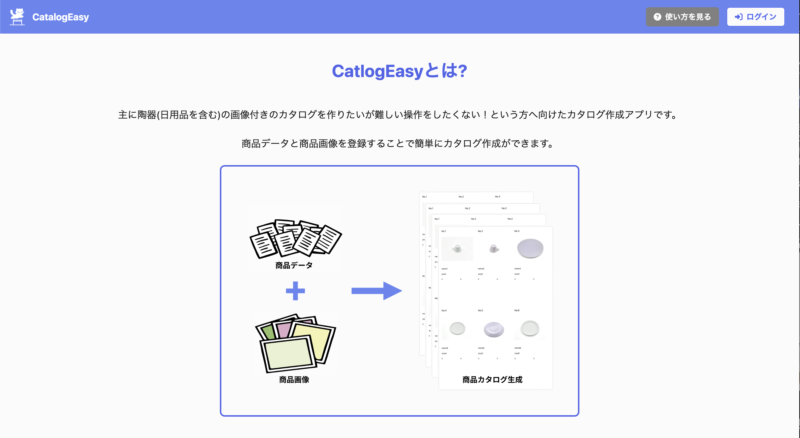
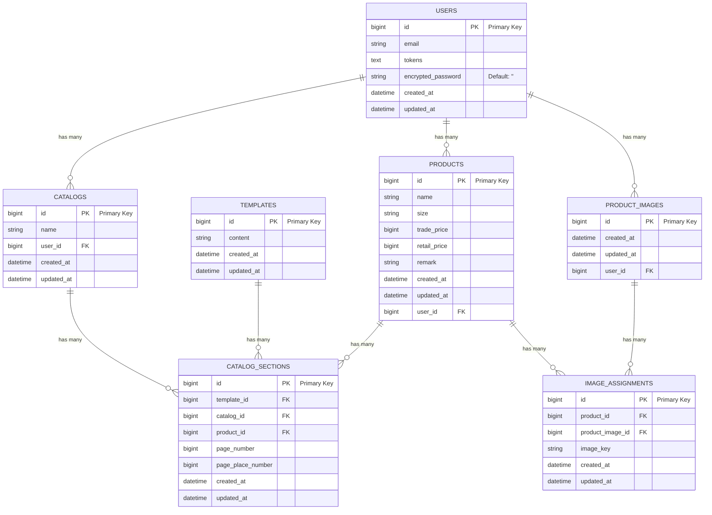

# CatalogEasy

## 概要

商品の画像付きのカタログを作りたいけどPC操作が苦手な両親へ向けたカタログ作成アプリです。

商品データと商品画像を登録することで簡単にカタログ作成ができます。

</img>

## オリジナルプロダクトの URL 
https://app.catalog-easy.com

* 右上の「Guestでログイン」からゲストユーザーとしてサービスをお試しいただけます。
* AM 1:00 ~ AM8:00(JST)はサービス停止しています。

## Qiita記事
このプロダクトを作成した背景を解説しています。

https://qiita.com/keiswe/items/fa59444fdaac3f1be1b9

## 使用技術
### フロントエンド
  - TypeScript
  - Next.js
    - 主要ライブラリ ([選定理由](#選定理由)で解説)
      - Yamada UI、shadcn/ui、React Hook Form、React-Draggable、Axios、Prettier、ESLint、Lefthook
### バックエンド
  - Ruby on Rails
    - 主要gem ([選定理由](#選定理由)で解説)
      - devise_token_auth、rubocop、bycrypt、rack-cors
  - Nginx
### インフラ
  - AWS ([選定理由](#選定理由)で解説)
    - ECS Fargate、ECR、Amplify、RDS、ALB、Route53、ACM、S3
  - Mysql
  - Docker、Docker Compose 

## 機能一覧
### ユーザー利用機能
  - ログイン&ユーザー登録機能
  - 商品情報CSV読み込み機能
  - 商品画像/情報登録機能
  - カタログ作成機能
  - カタログ一覧機能
  - カタログPDF出力機能
  
### ユーザー非利用機能
  - UI
    - 親切な使用方法の解説
    - 機能を盛り込みすぎないことによる使いやすさ

  - セキュリティ
    - Route53、ACMを使用した独自ドメイン、SSL化対応
    - トークンを利用した認証
    - プラウザ側でのURLの暗号化

  - 開発
    - 静的解析ツールを用いたコード品質担保
    - GitHub Actionsによる自動デプロイ
    - Amplifyによる自動デプロイ
    - Dockerを用いたデプロイ効率化
    - UIコンポーネント(Yamada UI)を用いた開発の簡略化
    - Lefthookを用いたコミット前の静的解析ツール実行

## 選定理由
### 主要ライブラリ(フロントエンド)
  - Yamada UI、shadcn/ui
    - シンプルなUIを実現できるため
  - React Hook Form
    - 動的なフォームのバリデーションとフォームの状態管理を簡単に実装できるため
  - React-Draggable
    - ドラッグ&ドロップ機能を簡単に実装できるため
  - Axios
    - リクエスト前の前処理が簡単にできるため
  - Prettier、ESLint
    - コード品質担保のため
  - lefthook
    - コミット前に自動で静的解析ツールを走らせるため
  
### 主要gem(バックエンド)
  - devise_token_auth
    - 小規模アプリで、ユーザー認証が容易であるトークン認証を採用。
  - bycrypt
    - クライアント側でURLを暗号化させるため
  - rack-cors
    - APIの呼び出し時のCORS対応のため
  - rubocop
    - コード品質担保のため
 
### 主要AWSサービス(インフラ)
- ECS Fargate
  - Rails APIのデプロイのために使用。Docker開発におけるデプロイ負担の軽減のため
- ECR
  - Rails API、Nginxコンテナイメージ保存のため
- Amplify
  - Next.jsをデプロイするために使用。デプロイの容易さや、Vercelに比べ、AWS内のサービスとの連携が簡単にできるため
- S3
  - 画像アップロードのため。VPCのエンドポイントからアクセスできるように設定
- RDS(Mysql)
  - Rails APIのデータ保存のために使用。(マルチAZ)必要に応じてスケーリングが容易なため
- ALB
  - ECS Fargateへのトラフィック分散を行うため
- Route53
  - Rails、Next.jsのアプリケーションの独自ドメイン設定のため
- ACM
  - SSL化のため

## インフラ構成図
</img>

## ER 図

## 今後アップデートしたい内容
  - fetch使用部分の全面サーバーコンポーネント化
    - セキュリティ向上、fetch時のパフォーマンス向上のため
  - カタログ編集機能
  - テンプレート機能
  - 過去登録した商品情報からカタログ作成機能
  - カタログ名編集機能

