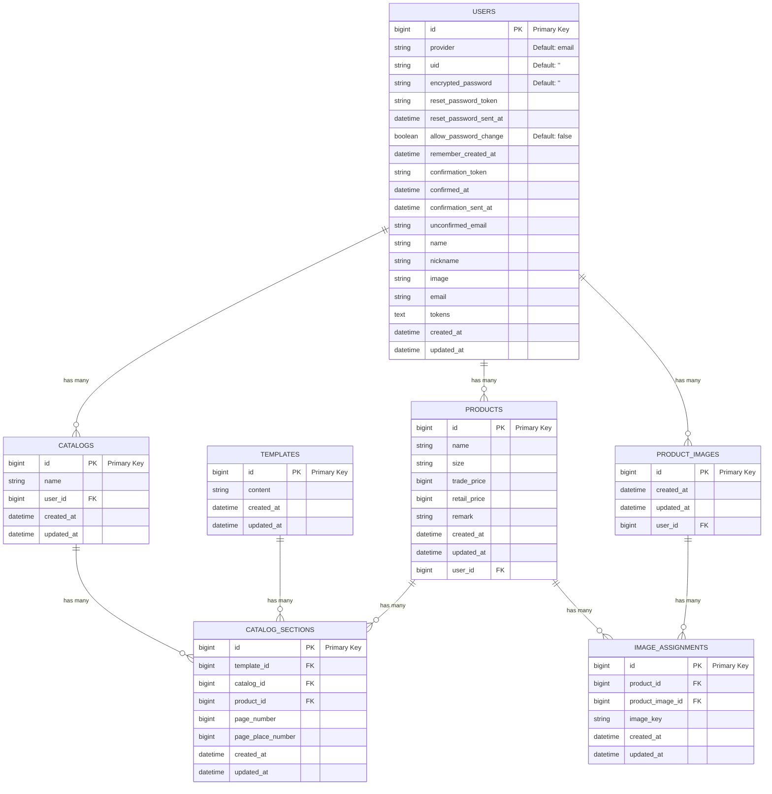

```mermaid
erDiagram
    USERS {
        bigint id PK "Primary Key"
        string provider "Default: email"
        string uid "Default: ''"
        string encrypted_password "Default: ''"
        string reset_password_token
        datetime reset_password_sent_at
        boolean allow_password_change "Default: false"
        datetime remember_created_at
        string confirmation_token
        datetime confirmed_at
        datetime confirmation_sent_at
        string unconfirmed_email
        string name
        string nickname
        string image
        string email
        text tokens
        datetime created_at
        datetime updated_at
    }

    PRODUCTS {
        bigint id PK "Primary Key"
        string name
        string size
        bigint trade_price
        bigint retail_price
        string remark
        datetime created_at
        datetime updated_at
        bigint user_id FK
    }

    CATALOGS {
        bigint id PK "Primary Key"
        string name
        bigint user_id FK
        datetime created_at
        datetime updated_at
    }

    PRODUCT_IMAGES {
        bigint id PK "Primary Key"
        datetime created_at
        datetime updated_at
        bigint user_id FK
    }

    IMAGE_ASSIGNMENTS {
        bigint id PK "Primary Key"
        bigint product_id FK
        bigint product_image_id FK
        string image_key
        datetime created_at
        datetime updated_at
    }

    CATALOG_SECTIONS {
        bigint id PK "Primary Key"
        bigint template_id FK
        bigint catalog_id FK
        bigint product_id FK
        bigint page_number
        bigint page_place_number
        datetime created_at
        datetime updated_at
    }

    TEMPLATES {
        bigint id PK "Primary Key"
        string content
        datetime created_at
        datetime updated_at
    }

    USERS ||--o{ PRODUCTS : "has many"
    USERS ||--o{ CATALOGS : "has many"
    USERS ||--o{ PRODUCT_IMAGES : "has many"
    CATALOGS ||--o{ CATALOG_SECTIONS : "has many"
    TEMPLATES ||--o{ CATALOG_SECTIONS : "has many"
    PRODUCTS ||--o{ CATALOG_SECTIONS : "has many"
    PRODUCTS ||--o{ IMAGE_ASSIGNMENTS : "has many"
    PRODUCT_IMAGES ||--o{ IMAGE_ASSIGNMENTS : "has many"
```